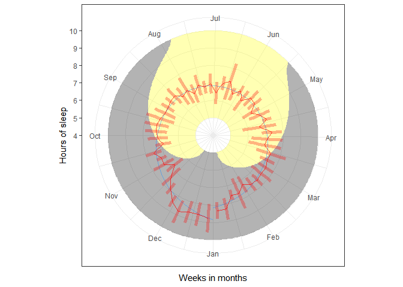
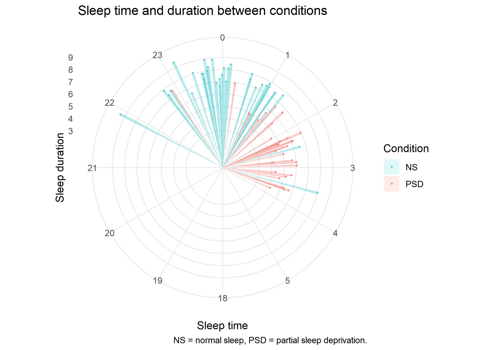
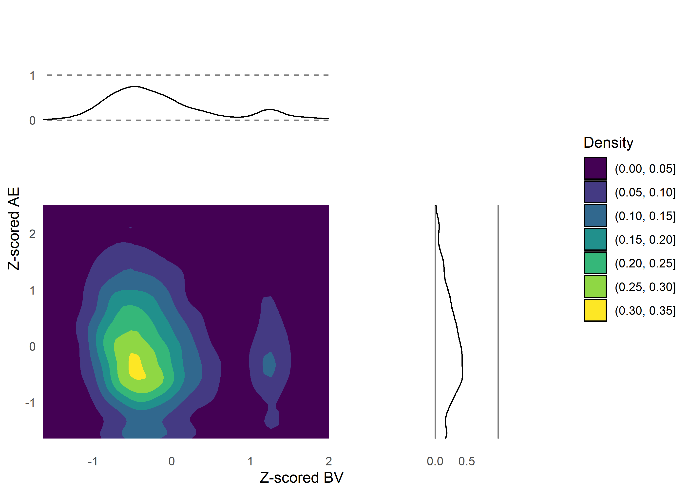

# PSY-3006 - Indepdendent study: Visualization in R with ggplots2

Candidate number: 21

The repository is available at
https://github.com/a-asen/PSY-3006-Visualization (as part of the course
requirement). The repository will be published as a “release” with the
tag “exam”, such that no changes to the exam delivery can take place.
The exam deadline is 1st of December 2023. The exam is around 11100
words, which corresponds to about 25 pages of text.



# Visualizing

Data visualization is a fundamental tool for comprehending and analysing
data, proving invaluable for both researchers and non-experts. This
seemingly simple technique efficiently distils complex data structures
into accessible insights, overcoming the potential incomprehensibility
of intricate datasets. The evolution of technology has significantly
eased the process of data visualization, with the rise of open-source
programs enabling widespread access to this skill. Among these tools, R
stands out as a prominent open-source program, boasting a rich library
of packages. Notably, the “ggplot2” library plays a pivotal role in
adhering to a “grammar” for effective data visualization.

## The Grammar of graphics

Leland Wilkinson’s “The Grammar of Graphics” delineates a framework for
crafting a “grammar” of graphics. This foundational book provides
essential insights into structuring the grammar required for creating
meaningful visualizations. Importantly, it transcends reliance on a
specific coding language, emphasizing a universal understanding of how
to structure the grammar for visualization.

## Course goal: mastering ggplot2

This course centres around the practical application of the ggplot2
package in R for data visualization, building upon the principles laid
out in “The Grammar of Graphics.” The framework empowers learners to
visualize data in R by leveraging this grammar-centric approach. Beyond
ggplot2 mastery, the course necessitates proficiency in version control
like Git, and reporting tools like Quarto.

Git is a software used to store different versions of a code which
enables effective error resolution by allowing users to revert to
previous versions, and it enhances the reproducibility of analyses.
Moreover, it serves as a vital tool for collaborative coding efforts,
streamlining coordination among team members. Furthermore, leveraging
services like Github or OSF facilitates seamless sharing of code in a
transparent manner, enhancing collaborative and open workflows.

Quarto is a reporting tool built on Rmarkdown, which integrates
seamlessly with Markdown’s lightweight markup language. This combination
facilitates structured text files with embedded R code and output.
Quarto, introduces its own syntax improvements, notably enabling inline
code with the “\`”. This feature proves invaluable in data analysis
scenarios where changes to a single aspect may necessitate rewriting
numbers.

## Circle visualization

Circular visualization deviates from the conventional rectangular
depiction of data, where a plot typically employs x and y-axes. This
alternative representation, connecting back to itself circularly, is not
widely adopted due to inherent challenges, as we will explore in this
section. Despite its limited application, circular visualization proves
valuable in specific scenarios, especially when dealing with data
exhibiting a natural circular pattern—such as seasonal fluctuations over
days and hours. Wilkinson (2006, page 213) advocates for the use of
circle plots in showcasing seasonal data. In the following section,
comprising two exercises, we delve into the nuanced practice of
visualizing data in a circular format.

### Ex1: Seasonal sleep

The initial part centres on circular visualization of simulated seasonal
sleep data. This dataset represents the sleep patterns of an imaginary
participant, showcasing longer sleep durations during winter and shorter
durations in summer, with considerable variability throughout the year.
The exercise aims to uncover effective methods for visualizing this
intricate sleep data. Upon exploration, visualizing every data point
throughout the year proves challenging, introducing difficulties in
associating each data point with a specific day. To enhance
interpretability, the data is aggregated weekly, and an error bar is
introduced, resulting in a more coherent visualization. While circular
visualization offers aesthetically pleasing figures, the compromise on
accurate data representation raises considerations. Comparatively, a
conventional rectangular plot provides a comprehensive overview of sleep
distribution throughout the year, making it easier to discern changes in
sleep patterns over time. Although this format may be less intuitive for
capturing seasonal relationships, it highlights the trade-offs inherent
in adopting circle plots for season-based data visualization. To delve
deeper into the efficacy of circle plots, the focus shifts to
visualizing the sleep times of participants in a sleep experiment.

The report for exercise 1 can be found
[here](https://github.com/a-asen/PSY-3006-Visualization/blob/main/ex1/report/Circle%20plot%20-%20seasonal%20sleep.md).
Final figure is displayed below:

### Ex2: Sleep times

In the second exercise, the focus shifts to visualizing sleep times
under two distinct conditions. Participants experienced either normal
sleep or sleep deprivation, with the latter involving a 3-hour delay in
bedtime. The expectation was clear: sleep times should exhibit
noticeable differences between the two conditions. To achieve this, I
experimented with visualizing sleep time in relation to the hours on a
circular plot, referencing a standard 12-hour clock. The height of the
points corresponded to the number of hours slept, allowing for a
comparison between those sleeping under normal conditions and those
undergoing sleep deprivation.

The exploration extended to considering a 24-hour clock for
visualization, ultimately opting for a split by 12 hours, from 18 to 6.
This choice aligned with the relevant time window and provided
meaningful correspondence to a 12-hour clock (with 24 positioned at the
top). Although alternative suggestions, such as an am/pm split and the
inclusion of wake time, were considered, they presented trade-offs. An
investigation into a 24-hour clock, including wake times, offered fewer
details in sleep times. Importantly, the key informative factors
remained sleep time and sleep length, as wake times did not exhibit
significant differences between conditions. This simplification enhances
the interpretability of results and underscores the rationale for
focusing on sleep times rather than wake times.

The report for exercise 2 can be found
[here](https://github.com/a-asen/PSY-3006-Visualization/blob/main/ex2/report/Circle%20plot%20-%20sleep%20times.md).
Final figure is displayed below:

## Multivariate visualization

In the subsequent exercises (ex3 and ex4), the emphasis shifts to
multivariate visualization—representing multiple variables in a single
plot. This approach is adopted to foster a more intuitive understanding
of inter-variable relationships, unveiling potential patterns and
connections. The dataset employed originates from a study on mind
wandering (MW), featuring variables MW, mind blanking (MB), approximate
entropy (AE), and behavioural variability (BV).

Mind wandering and mind blanking was captured on a 4-point Likert scale,
where lower values indicated instances of mind wandering, and mind
blanking (i.e., contenteless thoughts versus contentfull thoughts)
respectively. Moving beyond subjective measures, approximate entropy
(AE) offers a continuous score reflecting the sequence randomness
generated by participants, with higher values indicating increased
randomness—considered desirable in this context. Additionally,
behavioural variability (BV) serves as a continuous variable, providing
insights into participants’ consistency in response timing across
varying sequence lengths.

The first part of this exploration (ex3) delves into visualizing two
continuous variables, while the subsequent section (ex4) extends the
inquiry to encompass a combination of a continuous and a categorical
variable.

### Ex3: Continuous-continuous

In this exercise, I explored the joint distribution of AE and BV, aiming
to uncover patterns in their relationship. To achieve this, I
experimented with various visualization methods, ultimately opting for a
2D density plot. One of the expectations about the relationship of the
variables is that when AE is high, BV should be low. This would reflect
that the participant is focus on the task by producing random sequences
and tapping consistently. However, when the participant is not focused
on the task (i.e., MW), AE should be low and tapping variability should
be high.

Despite the expectation, any clear pattern was difficult to dicern.
However, a slight trend emerged: higher values of BV tended to align
with lower values of AE, and vice versa. While the relationship is not
crystal clear, the joint distribution visualization indicates a
suggestive pattern in the expected direction, reinforcing the connection
between AE and BV.

The report for exercise 3 can be found
[here](https://github.com/a-asen/PSY-3006-Visualization/blob/main/ex3/report/Multivariate%20visualization%20ex3.md).
Final figure is displayed below:

### Ex4: Categorical-continuous

For the final visualization (ex4), I delved into exploring the
distribution of AE across different mind wandering (MW) responses. This
approach promises a more meaningful analysis, anticipating higher AE
scores when participants report being on-task compared to off-task
moments. Departing from the joint distribution in the previous exercise,
I began by exploring various visualization methods and ultimately
adopted ggridges for its effectiveness in handling overlapping
distributions over categorical values.

Despite initial expectations, the AE figures did not distinctly indicate
an increase during on-task reports (3-4). For this reason, I quickly
visualized measures of flowers from the “iris” dataset found in base R.
This plot clearly indicate differences in the distributions, something
which we might have expected. Therefore, I further investigated the
relationship of the other variables, such as BV and MB. However, none of
these yielded particular different distributions.

For the final visualization (ex4), I delved into exploring the
distribution of AE across different mind wandering (MW) responses. This
approach promises a more meaningful analysis, anticipating higher AE
scores when participants report being on-task compared to off-task
moments. Departing from the joint distribution in the previous exercise,
I began by exploring various visualization methods and ultimately
adopted ggridges for its effectiveness in handling overlapping
distributions over categorical values.

Despite initial expectations, the AE figures did not distinctly indicate
an increase during on-task reports (3-4). For this reason, I quickly
visualized measures of flowers from the “iris” dataset found in base R.
This comparison clearly indicates differences in the distributions,
aligning with what we might have expected. Subsequently, I delved into
the relationship of other variables, such as BV and MB. However, none of
these yielded particular different distributions.

The report for exercise 4 can be found
[here](https://github.com/a-asen/PSY-3006-Visualization/blob/main/ex4/report/Multivariate%20visualization%20ex4.md).
Final figure is displayed below:

