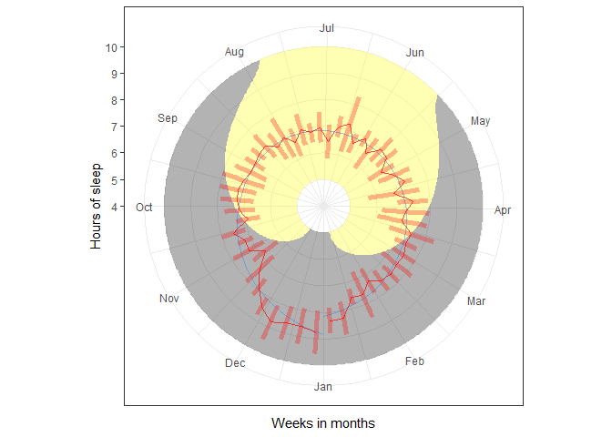
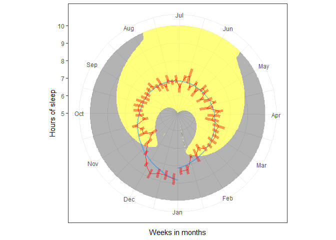
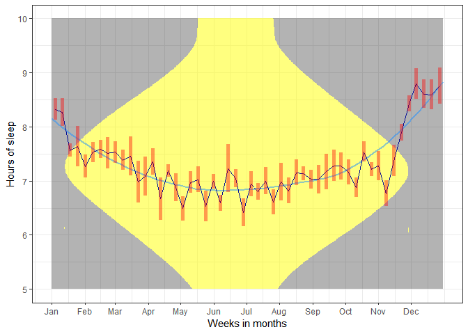
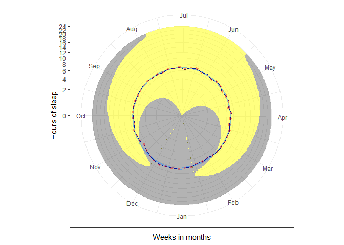

# Circle Plot: Seasonal sleep





The motivation for creating a circle plot is to visualize data in
relation to seasons. Seasons are a recurring natural phenomenon that can
significantly impact various aspects of our lives, from weather patterns
to human behaviour. Visualizing data in a circle may offer a novel way
to explore seasonal changes.

This approach may be valuable for data sets related to changes over
time, particularly over seasons. Take for instance, Tromsø, it is
located above [above the arctic
circle](https://en.wikipedia.org/wiki/Arctic_Circle) and exhibits some
of the most extreme daylight changes - from no sunlight in winter, to
only sunlight in summer. A remarkable change in season which could
neatly be displayed in a circular plot.

For this purpose, I would like to explore the utility of visualizing a
data circularly. We recently had a study that investigated participants
when they were sleeping deprived and when they were not. To this end, we
gathered data regarding participants’ sleep time and wake time, as well
as controlling with an Actigraphy. Although I will not use that data
here, the data is well suited to visualize changes during a season.

With this idea in mind, I have created fake sleep data of X along with
the sleep rise and set times located at Tromsø. The sleep data follow
the pattern of the sun changes throughout the year, along with some
additional noise. The goal is to visualize the sleep time, wake time,
and sun rise changes throughout a year (2022) circularly.

We first load the relevant packages and retrieve the data.

``` r
library(tidyverse) # libs
load("../data/sleep_data.rdata") # load data
```

To start off, we can visualize the data according to sleep amount
throughout the year.

``` r
sleep_data |>
  ggplot(aes(x=cumulative_days, y=sleep_amount))+
  geom_point()
```


We can see that the data starts off high (in January) and reduces
towards the middle (summer) and increases towards the end (winter). To
investigate the average throughout the year, we can add a geom_smooth.

``` r
sleep_data |>
  ggplot(aes(cumulative_days, sleep_amount))+
  geom_point()+
  geom_smooth()
```

    `geom_smooth()` using method = 'loess' and formula = 'y ~ x'


To put our plot in context, we can add the amount of daylight in each
day throughout the year.

``` r
sleep_data |>
  ggplot(aes(cumulative_days, sleep_amount))+
  geom_area(mapping=aes(y=daylight_length_h), fill="yellow", alpha = .5)+
  # Area before data points to keep it in the background
  geom_point()+
  geom_smooth()
```

    `geom_smooth()` using method = 'loess' and formula = 'y ~ x'


The yellow area represents the number of hours of daylight each day
receives. As we can see, the sunlight varies from nothing (at the start
and end of the x-axis) to all day (in the middle of the x-axis).

Alternatively, we can display the amount of dark hours throughout the
year.

``` r
sleep_data |>
  ggplot(aes(cumulative_days, sleep_amount))+
  geom_ribbon(mapping=aes(ymin=daylight_length_h, ymax=24, 
                          xmin=cumulative_days, xmax=cumulative_days), 
              fill="black", alpha=.5)+
  geom_point()+
  geom_smooth()
```

    `geom_smooth()` using method = 'loess' and formula = 'y ~ x'


The dark area represents the amount of darkness that each day receives.
However, adding both together might aid in interpreting the plot.

``` r
sleep_data |>
  ggplot(aes(cumulative_days, sleep_amount))+
  geom_area(mapping=aes(y=daylight_length_h), fill="yellow", alpha = .5)+
  geom_ribbon(mapping=aes(ymin=daylight_length_h, ymax=24, 
                          xmin=cumulative_days, xmax=cumulative_days), 
              fill="black", alpha=.5)+
  # Ribbon before data points to keep it in the background
  geom_point()+
  geom_smooth()
```

    `geom_smooth()` using method = 'loess' and formula = 'y ~ x'


Now, with this plot, we can more easily discern between darkness and
sunlight throughout the year. We will leave some alpha to be able to see
the underlying grid.

To finish up our simple plot, We can add some aesthetic changes to the
plot to make it more pleasing.

``` r
sleep_data |>
  ggplot(aes(cumulative_days, sleep_amount))+
  geom_area(mapping=aes(y=daylight_length_h), fill="yellow", alpha = .4)+
  geom_ribbon(mapping=aes(ymin=daylight_length_h, ymax=24, 
                          xmin=cumulative_days, xmax=cumulative_days), 
              fill="black", alpha=.4)+
  # Ribbon before data points to keep it in the background
  geom_point()+
  geom_smooth()+
  theme_bw()+
  coord_cartesian(expand=F)+
  scale_x_continuous(breaks=seq(0,365,30))+
  scale_y_continuous(breaks=seq(0,24,4))
```

    `geom_smooth()` using method = 'loess' and formula = 'y ~ x'


Here we can quite neatly see the amount of sleep each day in relation to
the number of daylight hours. Although we should note that a lot of date
is being shown that does not contain a lot of data. For instance, the
distance over 11 hours and below 5 hours contain very little data as
compared to in between 11 and 5. This could be ameliorated by condensing
the sunlight hours within this span. Either by transformation, or, with
a different, right hand, scale, ranging from 0 to 24 hours. The latter
of which might be more satisfactory to understand the radical changes
throughout the year. However, I will move on to visualizing in a
circular way, and then discuss and suggest a final plot.

## Circular plot

It is rather easy to display data in circles using ggplot. We can simply
use the code “coord_polar” which transforms the data to fit a circle.
However, some of my earlier attempts utilized the “circlize” with
inspiration from [R-Gallery - chord
diagram](https://www.kyle-w-brown.com/R-Gallery/flow.html#chord-diagram).
A package that works great, but is more limiting than ggplots. Moreover,
Kyle Brown also talks about [circular
barplots](https://www.kyle-w-brown.com/R-Gallery/ranking.html#circular-barplot)
earlier in the book, which utilizes ggplot.

As discussed earlier, the benefits of using ggplots is that it is made
to be flexible at the various stages of visualizing data. On the other
hand, [*circlize* is based
on](https://jokergoo.github.io/circlize_book/book/introduction.html)
[Circos](http://circos.ca/) a Perl implementation of circular data
visualization, which is implemented particularly for genomic research.
Which seems to be both its strength and, in my case, its flaws.
Therefore, utilizing ggplots may be beneficial for my case, as it has
more flexibility in changing the plot.

First, I tested the “coord_polar” implementation.

``` r
sleep_data |>
  ggplot(aes(x=cumulative_days, y=sleep_amount))+
  geom_point()+
  coord_polar()
```


It seems that the transformation also limits the range of the y-axis for
us. The automatic limitation seems somewhat problematic, as our smallest
data point is in the very centre of the plot. Moreover, the layout of
the circle does not follow the convention I would like to follow. In my
case, I would like the year to start at the bottom (1 of January) and
have breaks at each (or approximately) month.

``` r
sleep_data |>
  ggplot(aes(x=cumulative_days, y=sleep_amount))+
  geom_point()+
  coord_polar(direction = -1, start = pi)+
  scale_x_continuous(breaks = seq(0,365,30))
```


We can then add all the elements from the previous plot to investigate
how it will look in a circular plot.

``` r
sleep_data |>
  ggplot(aes(x=cumulative_days, y=sleep_amount))+
  geom_area(mapping=aes(y=daylight_length_h), fill="yellow", alpha = .4)+
  geom_ribbon(mapping=aes(ymin=daylight_length_h, ymax=24, 
                          xmin=cumulative_days, xmax=cumulative_days), 
              fill="black", alpha=.4)+
  # Ribbon before data points to keep it in the background
  geom_point()+
  geom_smooth()+
  coord_polar(direction = -1, start = pi)+
  theme_bw()+
  scale_x_continuous(breaks=seq(0,365,30))+
  scale_y_continuous(breaks=seq(0,24,4))
```

    `geom_smooth()` using method = 'loess' and formula = 'y ~ x'


The plot looks more interesting as the sunlight changes throughout the
year. However, it is much harder to grasp the values of the sleep
amount. As noted earlier, a remedy for this is to transform the
daylight_length_h to correspond to the sleep amount. We can do this by
reducing the maximum value by some value, let’s use 3. Then the plot
daylight visualization should extend to, and not beyond, 8 (24/3).

``` r
reduction <- 3
sleep_data |>
  ggplot(aes(x=cumulative_days, y=sleep_amount))+
  geom_area(mapping=aes(y=daylight_length_h/reduction), 
            fill="yellow", alpha = .4)+
  geom_ribbon(mapping=aes(ymin=daylight_length_h/reduction, ymax=24/reduction, 
                          xmin=cumulative_days, xmax=cumulative_days), 
              fill="black", alpha=.4)+
  # Ribbon before data points to keep it in the background
  geom_point()+
  geom_smooth()+
  coord_polar(direction = -1, start = pi)+
  theme_bw()+
  scale_x_continuous(breaks=seq(0,365,30))+
  scale_y_continuous(breaks=seq(0,24,2))+
  geom_vline(xintercept=75, alpha =.6, linetype="dashed")+
  geom_vline(xintercept=270, alpha =.6, linetype="dashed")
```

    `geom_smooth()` using method = 'loess' and formula = 'y ~ x'


With this transformation, the daylight hours overlap nicely with the
data. Although it might be misleading that it suggests that each “day”
is less than 8 hours. Nevertheless, this can be ameliorated by
indicating in the (or a) text that it is a transformation in this
manner. Moreover, much of the daylight length overlap with the data
points, which we can fix by either increasing or decreasing the size.

One design feature is to reduce the daylight length by a number that
ends up even. By doing so, the jumps of the y-axis (steps of 2 hours),
which I have implemented, will overlap nicely with meaningful changes in
daylight length. Take for instance that by day 75 and 270 (see the
dashed lines) half the day contains sunlight and the other half contains
no sunlight. This can rather easily be gathered as the range of the
daylight is 8 hours, half of it is 4 hours, which indicate 24 and 12
hours respectively.

I will first try to increase it by dividing by 2 instead of 3.

``` r
reduction <- 2
sleep_data |>
  ggplot(aes(x=cumulative_days, y=sleep_amount))+
  geom_area(mapping=aes(y=daylight_length_h/reduction), 
            fill="yellow", alpha = .4)+
  geom_ribbon(mapping=aes(ymin=daylight_length_h/reduction, ymax=24/reduction, 
                          xmin=cumulative_days, xmax=cumulative_days), 
              fill="black", alpha=.4)+
  # Ribbon before data points to keep it in the background
  geom_point()+
  geom_smooth()+
  coord_polar(direction = -1, start = pi)+
  theme_bw()+
  scale_x_continuous(breaks=seq(0,365,30))+
  scale_y_continuous(breaks=seq(0,24,2))
```

    `geom_smooth()` using method = 'loess' and formula = 'y ~ x'


Here, the daylight length extends beyond the data points, but still
overlaps with each data point. We can try to reduce the daylight length
to reach, maximally, below the lowest data point.

``` r
reduction <- 6
sleep_data |>
  ggplot(aes(x=cumulative_days, y=sleep_amount))+
  geom_area(mapping=aes(y=daylight_length_h/reduction), 
            fill="yellow", alpha = .4)+
  geom_ribbon(mapping=aes(ymin=daylight_length_h/reduction, ymax=24/reduction, 
                          xmin=cumulative_days, xmax=cumulative_days), 
              fill="black", alpha=.4)+
  # Ribbon before data points to keep it in the background
  geom_point()+
  geom_smooth()+
  coord_polar(direction = -1, start = pi)+
  theme_bw()+
  scale_x_continuous(breaks=seq(0,365,30))+
  scale_y_continuous(breaks=seq(0,24,2))
```

    `geom_smooth()` using method = 'loess' and formula = 'y ~ x'


In this display, the data points are the main focus of the plot, but the
daylight length is nicely illustrated. On the other hand, it appears as
though the illustration is more of a symbol or icon than displaying
something useful.

To further enhance the difference between the data points, we can
further transform the daylight visualization. Due to the way
*coord_polar* implements the range of the y-axis, it will reduce the
plot to the smallest value on the plot. In the first circle plot
implementation, the smallest value was close to 6, and so the plot
started at 6 (at the very centre). By replacing *geom_area* with
*geom_ribbon*, we can limit our daylight visualization to start at some
value above 0, since there is no valuable data presented before the 6th
hour. With this, we can also retain the contour of the year-round
daylight length, in similar ways as we have done previously.

``` r
reduction <- 4  
additional_start <- 4
sleep_data |>
  ggplot(aes(x=cumulative_days, y=sleep_amount))+
  geom_ribbon(mapping=aes(ymin=additional_start, 
                          ymax=(daylight_length_h/reduction)+additional_start,
                          xmin=cumulative_days, xmax=cumulative_days), 
              fill="yellow", alpha = .4)+
  geom_ribbon(mapping=aes(ymin=(daylight_length_h/reduction)+additional_start,
                          ymax=24/reduction+additional_start, 
                          xmin=cumulative_days, xmax=cumulative_days), 
              fill="black", alpha=.4)+
  # Ribbon before data points to keep it in the background
  geom_point()+
  geom_smooth()+
  coord_polar(direction = -1, start = pi)+
  theme_bw()+
  scale_x_continuous(breaks=seq(0,365,30))+
  scale_y_continuous(breaks=seq(0,24,1))
```

    `geom_smooth()` using method = 'loess' and formula = 'y ~ x'


In this plot, it is easier to discern the difference between each data
point, while also retaining the relative change in daylight throughout
the year. It is important to point out that the daylight visualization
illustrates the relative change in daylight and not hour-based changes.
It will be important to point out in the text how the daylight is
transformed in text to not lead to misunderstandings.

Another change was to increase the number of ticks on the y-axis to be
able to better see differences between the data points.

### Sleep and wake times

Another way of visualizing the sleep amount is to visualize the sleep
time and wake time. This, however, might be more difficult as the span
ranges from around 5 hours to above 24 hours (indicating going to sleep
later than 24, which should be transformed to 0). Nevertheless, it is
worth investigating how the plot changes.

``` r
sleep_data |>
  ggplot(aes(x=cumulative_days, y=wake_time))+
  geom_point()+
  geom_point(mapping=aes(y=sleep_time))+  # add sleep time 
  coord_polar(direction = -1, start = pi)+
  theme_bw()+
  scale_x_continuous(breaks=seq(0,365,30))+
  scale_y_continuous(breaks=seq(0,24,2))
```


In this plot, it is much harder to see differences between each data
point. This is because the range of each band of data points (sleep time
around 24 and wake time around 8) is minimal, but the difference between
each band is large (around 16 hours). We end up with a plot with a lot
of dead space, conveying no information, between the high band and the
small band. To fix this, we can transform either the sleep time or wake
time. I will first try to reduce the sleep time by 24.

``` r
reduction <- 24
sleep_data |>
  ggplot(aes(x=cumulative_days, y=wake_time))+
  geom_point()+
  geom_point(mapping=aes(y=24-sleep_time))+  # add sleep time 
  coord_polar(direction = -1, start = pi)+
  theme_bw()+
  scale_x_continuous(breaks=seq(0,365,30))+
  scale_y_continuous(breaks=seq(0,24,2))
```


Although we are better able to see the differences between the data
points, the plot is rather similar to the former. It contains a cluster
of data points in the centre, which is not that neat and rather
uninformative. At any rate, one of the ideas of visualizing sleep and
wake times is to create a band that indicates the sleep.

``` r
reduction <- 2
additional_start <- 0
sleep_data |>
  ggplot(aes(x=cumulative_days, y=wake_time))+
  geom_ribbon(mapping=aes(xmin=cumulative_days, xmax=cumulative_days,
                          ymin=24-sleep_time, ymax=wake_time), alpha =.4)+
  geom_point()+
  geom_point(mapping=aes(y=24-sleep_time))+  # add sleep time 
  coord_polar(direction = -1, start = pi)+
  theme_bw()+
  scale_x_continuous(breaks=seq(0,365,30))+
  scale_y_continuous(breaks=seq(0,24,2))
```


The plot does indicate the band of sleep from sleep time to wake time.
However, it seems rather weird to have the cluster of data points in the
centre. Moreover, the cluster is rather uninformative, as it is
difficult to gather the relationship between sleep and wake time. To
investigate whether this is a problem with circular plots or visualizing
data in this way, I will visualize it using a normal plot (by removing
*coord_polar*).

``` r
reduction <- 2
additional_start <- 0
sleep_data |>
  ggplot(aes(x=cumulative_days, y=wake_time))+
  geom_ribbon(mapping=aes(xmin=cumulative_days, xmax=cumulative_days,
                          ymin=24-sleep_time, ymax=wake_time), alpha =.4)+
  geom_point()+
  geom_point(mapping=aes(y=24-sleep_time))+  # add sleep time 
  theme_bw()+
  scale_x_continuous(breaks=seq(0,365,30))+
  scale_y_continuous(breaks=seq(0,24,2))
```


This way of visualizing seems to be fine to me. With a normal plot, we
can see changes in *both* sleep times and wake times. This information
is essentially lost in the circular plot, but evidence with this plot.
Moreover, the band seems to add meaningful relations between each data
point - you can see ups and downs of sleep/wake times.

To visualize with a circle plot, I believe it is best to only use sleep
amount. It does not create a cluster of data points that are
uninformative or incredibly difficult to interpret. Moreover, the range
of sleep can be displayed with a range from the data point to the centre
of the plot. I will revert to the last plot with sleep amount to
investigate whether it can be useful to include a ribbon from the data
point to the “null” value.

``` r
reduction <- 4  
additional_start <- 4
sleep_data |>
  ggplot(aes(x=cumulative_days, y=sleep_amount))+
  geom_ribbon(mapping=aes(ymin=additional_start, 
                          ymax=(daylight_length_h/reduction)+additional_start,
                          xmin=cumulative_days, xmax=cumulative_days), 
              fill="yellow", alpha = .3)+
  geom_ribbon(mapping=aes(ymin=(daylight_length_h/reduction)+additional_start,
                          ymax=24/reduction+additional_start, 
                          xmin=cumulative_days, xmax=cumulative_days), 
              fill="black", alpha=.3)+
  # Ribbon before data points to keep it in the background
  geom_ribbon(mapping=aes(xmin=cumulative_days, xmax=cumulative_days,
                          ymin=4,ymax=sleep_amount), alpha=.4)+
  geom_point()+
  geom_smooth()+
  coord_polar(direction = -1, start = pi)+
  theme_bw()+
  scale_x_continuous(breaks=seq(0,365,30))+
  scale_y_continuous(breaks=seq(0,24,1))
```

    `geom_smooth()` using method = 'loess' and formula = 'y ~ x'


Adding a ribbon from each data point to the centre value (in this case
4), we get some more contrast between each data point. This contrast can
be helpful in interpreting the data. However, since the ribbon only
extends to the centre value and not all the way to 0, it can appear as
though people start to sleep from the 4th hour of the night. If this
plot is used, it should be noted that the data starts from 0, but has
been cut out because it does not contain any relevant information.
Nevertheless, I wonder how the plot changes by reverting the centre
value to 0 instead of 4.

``` r
reduction <- 4  
additional_start <- 4
sleep_data |>
  ggplot(aes(x=cumulative_days, y=sleep_amount))+
  geom_ribbon(mapping=aes(ymin=additional_start, 
                          ymax=(daylight_length_h/reduction)+additional_start,
                          xmin=cumulative_days, xmax=cumulative_days), 
              fill="yellow", alpha = .3)+
  geom_ribbon(mapping=aes(ymin=(daylight_length_h/reduction)+additional_start,
                          ymax=24/reduction+additional_start, 
                          xmin=cumulative_days, xmax=cumulative_days),
              fill="black", alpha=.3)+
  # Ribbon before data points to keep it in the background
  geom_ribbon(mapping=aes(xmin=cumulative_days, xmax=cumulative_days,
                          ymin=0,ymax=sleep_amount), alpha=.4)+
  geom_point()+
  geom_smooth()+
  coord_polar(direction = -1, start = pi)+
  theme_bw()+
  scale_x_continuous(breaks=seq(0,365,30))+
  scale_y_continuous(breaks=seq(0,24,1))
```

    `geom_smooth()` using method = 'loess' and formula = 'y ~ x'


Serendipity. Forgetting to change the minimum value of the daylight
length seems to have improved it. In this plot, we can clearly see what
period of time contains *no sunlight*. The previous plots failed to
inform us what period contained no sunlight. Although I would not say
that the ribbon has added anything significant by visualizing all the
way to zero, it certainly informed us that some distance from the
minimum daylight value and the plot’s minimum value should be discerned.

``` r
reduction <- 4
additional_start <- 4
sleep_data |>
  ggplot(aes(x=cumulative_days, y=sleep_amount))+
  geom_ribbon(mapping=aes(ymin=additional_start, 
                          ymax=(daylight_length_h/reduction)+additional_start,
                          xmin=cumulative_days, xmax=cumulative_days), 
              fill="yellow", alpha = .3)+
  geom_ribbon(mapping=aes(ymin=(daylight_length_h/reduction)+additional_start,
                          ymax=24/reduction+additional_start, 
                          xmin=cumulative_days, xmax=cumulative_days), 
              fill="black", alpha=.3)+
  # Ribbon before data points to keep it in the background
  geom_ribbon(mapping=aes(xmin=cumulative_days, xmax=cumulative_days,
                          ymin=3.5,ymax=sleep_amount), alpha=.4)+
  geom_point()+
  geom_smooth(alpha = .2)+
  coord_polar(direction = -1, start = pi)+
  theme_bw()+
  scale_x_continuous(breaks=seq(0,365,30))+
  scale_y_continuous(breaks=seq(0,24,1))
```

    `geom_smooth()` using method = 'loess' and formula = 'y ~ x'


In this plot, the days with no sunlight are restricted, making it more
difficult to interpret which days contain no sunlight. To fix this, we
can further increase the difference between the daylight minimum and the
plot minimum (by increasing the range of the ribbon between each data
point and the centre).

``` r
reduction <- 4  
additional_start <- 4
sleep_data |>
  ggplot(aes(x=cumulative_days, y=sleep_amount))+
  geom_ribbon(mapping=aes(ymin=additional_start, 
                          ymax=(daylight_length_h/reduction)+additional_start,
                          xmin=cumulative_days, xmax=cumulative_days), 
              fill="yellow", alpha = .3)+
  geom_ribbon(mapping=aes(ymin=(daylight_length_h/reduction)+additional_start,
                          ymax=24/reduction+additional_start, 
                          xmin=cumulative_days, xmax=cumulative_days), 
              fill="black", alpha=.3)+
  # Ribbon before data points to keep it in the background
  geom_ribbon(mapping=aes(xmin=cumulative_days, xmax=cumulative_days,
                          ymin=2,ymax=sleep_amount), alpha=.4)+
  geom_point()+
  geom_smooth()+
  coord_polar(direction = -1, start = pi)+
  theme_bw()+
  scale_x_continuous(breaks=seq(0,365,30))+
  scale_y_continuous(breaks=seq(0,24,1))
```

    `geom_smooth()` using method = 'loess' and formula = 'y ~ x'


I would say this plot has a nicer balance between the distance of the
centre and the daylight length. However, it remains a question whether
it is necessary with a ribbon as compared to a simple line.

### Line connection

``` r
reduction <- 4  
additional_start <- 4
sleep_data |>
  ggplot(aes(x=cumulative_days, y=sleep_amount))+
  geom_ribbon(mapping=aes(ymin=additional_start, 
                          ymax=(daylight_length_h/reduction)+additional_start,
                          xmin=cumulative_days, xmax=cumulative_days), 
              fill="yellow", alpha = .3)+
  geom_ribbon(mapping=aes(ymin=(daylight_length_h/reduction)+additional_start,
                          ymax=24/reduction+additional_start, 
                          xmin=cumulative_days, xmax=cumulative_days), 
              fill="black", alpha=.3)+
  # Ribbon before data points to keep it in the background
  geom_point()+
  geom_line()+
  geom_smooth()+
  geom_point(mapping=aes(x=1,y=2), alpha =0)+ # off center
  coord_polar(direction = -1, start = pi)+
  theme_bw()+
  scale_x_continuous(breaks=seq(0,365,30))+
  scale_y_continuous(breaks=seq(0,24,1))
```

    `geom_smooth()` using method = 'loess' and formula = 'y ~ x'

-1.png)

Much of the same contrasts are retained in this plot without creating
too many colours. Adding too much non-essential ink can be confusing and
add to difficulty in interpreting the data. Thus, keeping non-essential
ink to a minimum is a great starting option. Moreover, the link between
each data point is, perhaps, better illustrated with simple lines than
with the ribbon. The main point of the ribbon was to create a link to
the centre and not between each data point.

I will end this part with a final plot of both a circle and a normal
plot and discuss some of their features.

``` r
reduction <- 4.8 
additional_start <- 5
sleep_data |>
  ggplot(aes(x=cumulative_days, y=sleep_amount))+
  geom_ribbon(mapping=aes(ymin=additional_start, 
                          ymax=(daylight_length_h/reduction)+additional_start,
                          xmin=cumulative_days, xmax=cumulative_days), 
              fill="yellow", alpha = .3)+
  geom_ribbon(mapping=aes(ymin=(daylight_length_h/reduction)+additional_start,
                          ymax=24/reduction+additional_start, 
                          xmin=cumulative_days, xmax=cumulative_days), 
              fill="black", alpha=.3)+
  # Ribbon before data points to keep it in the background
  geom_point()+
  geom_line()+
  geom_smooth(alpha=0)+
  geom_point(mapping=aes(x=1,y=4), alpha =0)+ # off center
  coord_polar(direction = -1, start = pi)+
  theme_bw()+
  scale_x_continuous(breaks=seq(0,365,30),labels = c(0, unique(sleep_data$date_m_name)))+
  scale_y_continuous(breaks=seq(4,24,1))+
  labs(x="Cumulative day", y="Hours of sleep")
```

    `geom_smooth()` using method = 'loess' and formula = 'y ~ x'


``` r
reduction <- 4.8
additional_start <- 5
sleep_data |>
  ggplot(aes(x=cumulative_days, y=sleep_amount))+
  geom_ribbon(mapping=aes(ymin=additional_start, 
                          ymax=(daylight_length_h/reduction)+additional_start,
                          xmin=cumulative_days, xmax=cumulative_days), 
              fill="yellow", alpha = .3)+
  geom_ribbon(mapping=aes(ymin=(daylight_length_h/reduction)+additional_start,
                          ymax=24/reduction+additional_start, 
                          xmin=cumulative_days, xmax=cumulative_days), 
              fill="black", alpha=.3)+
  # Ribbon before data points to keep it in the background
  geom_point()+
  geom_line()+
  geom_smooth(alpha=0)+
  coord_cartesian(expand=F)+
  theme_bw()+
  scale_x_continuous(breaks=seq(0,365,30))+
  scale_y_continuous(breaks=seq(5,24,1))+
  labs(x="Cumulative day", y="Hours of sleep")
```

    `geom_smooth()` using method = 'loess' and formula = 'y ~ x'


From the two plots, I would say they both have some advantages and
disadvantages. I would say that the circle plot better illustrates the
change in daylight length, which may be a bit more difficult to
interpret from the normal plot. On the other hand, the normal plot seems
to visualize each data point in relation to time and each other in a
much better way. We can more easily see the trend of the data, by both
following the mean and the data points. By contrast, both the data
points and the mean line are more cryptic in the circle plot, although
not impossible to see.

## Circular summary statistic

One way to ameliorate this problem is to reduce the amount of data that
is plotted. This can be done by summarizing to weeks or months.

``` r
sleep_data |>
  mutate(date_m_name = factor(date_m_name, 
                              labels = c("Jan","Feb","Mar",
                                         "Apr","May","Jun",
                                         "Jul","Aug","Sep",
                                         "Oct","Nov","Dec"))) |>
  ggplot(aes(x=date_m_name, y=sleep_amount))+
  geom_point(position=position_nudge(x=-.05), alpha=.2)+
  stat_summary(fun.data=mean_cl_normal, geom="pointrange", 
               color="red", position=position_nudge(x=.05))+
  theme_bw()
```


Splitting it by month makes it easier to see all the data points, but it
is less meaningful. Each black dot represents one day in each month, but
their relationship to the day is removed. This information is useful as
it tells us something about the trend of the data. However, with this
plot, it appears as though there are just random months that deviate
from the “norm”. Another way of visualizing could be through weeks. This
would benefit through summarizing more often, than in each month, and by
possibly visualizing the trend of the data.

``` r
sleep_data |>
  mutate(week = c(rep(1:52, each=7), 52)) |>
  ggplot(aes(x=week, y=sleep_amount))+
  geom_point(alpha=.5)+
  stat_summary(fun.data=mean_cl_normal, geom="pointrange", color="red")+
  stat_summary(fun = mean,geom="line", color="red", size=.5)+
  scale_x_continuous(breaks=seq(0,52,4))+
  theme_bw()
```

    Warning: Using `size` aesthetic for lines was deprecated in ggplot2 3.4.0.
    ℹ Please use `linewidth` instead.


Visualizing over weeks is more able to show the trend of the data, but
also reduces clutter. Nevertheless, we miss the exact relationship
between each data point and their day. There might be dependent
relationships between sleep, which can be lost with such a plot.
However, summarizing over weeks seems a nice compromise between showing
a point for every day and reducing it to some summary.

One of the problems with the circle plot was the data cluttered
together. This made it difficult to understand the exact relationship
between each day, and the day. However, by using a summary statistic, a
circle plot might be more effective at visualizing trends of the data
and reducing clutter.

``` r
sleep_data |>
  mutate(week = c(rep(1:52, each=7), 52)) |> 
  ggplot(aes(x=week, y=sleep_amount))+
  geom_point(alpha=.5)+
  stat_summary(fun.data=mean_cl_normal, geom="pointrange", color="red")+
  stat_summary(fun = mean,geom="line", color="red", size=.5)+
  scale_x_continuous(breaks=seq(0,52,2))+
  theme_bw()+
  coord_polar(direction = -1, start = pi)+
  geom_point(mapping=aes(x=53,y=5), alpha=0) # to make space between 1 and 52 week
```


Plotting circularly made week 0 and week 52 overlap. To overcome this
problem, I added a single, invisible, point in week 53 to create space
between 0 and 52. Using a summary statistic with a circle plot seems to
work better. It is now easier to discern changes in sleep across the
seasons. Nevertheless, visualizing each data point seems to still add
some clutter to the plot. To investigate further, I will make some
changes.

``` r
reduction <- 6
additional_start <- 6
sleep_data |>
  mutate(week = c(rep(1:52, each=7), 52)) |>
  ggplot(aes(x=week, y=sleep_amount))+
    geom_ribbon(mapping=aes(ymin=additional_start, 
                          ymax=(daylight_length_h/reduction)+additional_start,
                          xmin=week, xmax=week), fill="yellow", alpha = .3)+
  geom_ribbon(mapping=aes(ymin=(daylight_length_h/reduction)+additional_start,
                          ymax=24/reduction+additional_start, 
                          xmin=week, xmax=week), fill="black", alpha=.3)+
  stat_summary(fun.data=mean_cl_normal, geom="pointrange", color="red")+
  geom_smooth(alpha=0)+
  #stat_summary(fun = mean,geom="line", color="red", size=.5)+
  scale_x_continuous(breaks=seq(0,52,2))+
  theme_bw()+
  coord_polar(direction = -1, start = pi)+
  geom_point(mapping=aes(x=53,y=5), alpha=0)+ # to make space between 1 and 52 week
  labs(x="Week", y="Hours slept")
```

    `geom_smooth()` using method = 'loess' and formula = 'y ~ x'


In this plot, I removed each individual data point, removed the line
connection, added a smooth function, and added the daylight length.
Making these aesthetic changes did improve the ability of the circle
plot to convey accurate information. Although some unfortunate
concessions had to be made. For one, the empty data point made the
daylight length plot look awkward. Moreover, the visualization of the
daylight length changes in a step-wise manner, instead of smoothly.
Nevertheless, with this strategy, the circle plot can be used to convey
information in an interesting way. We can more easily see the trend of
the line, and we can get a sense of the distribution of the sleep amount
within each week.

Another way we might be able to use circle plots, is to summarize
through each month instead. However, we will be left with similar
problems as in the normal plot - you do not see the trend of the data
because it is so summarized.

``` r
sleep_data |>
  mutate(date_m_name = factor(date_m_name, 
                              labels = c("Jan","Feb","Mar",
                                         "Apr","May","Jun",
                                         "Jul","Aug","Sep",
                                         "Oct","Nov","Dec"))) |>
  ggplot(aes(x=date_m_name, y=sleep_amount))+
  geom_point(alpha=.2)+
  stat_summary(fun.data=mean_cl_normal, geom="pointrange", color="red")+
  geom_smooth()+
  theme_bw()+
  coord_polar(direction = -1, start = pi)
```

    `geom_smooth()` using method = 'loess' and formula = 'y ~ x'


Plotting with month leads to its own sets of problems, which seem worse.
Since the data is summarized more than in the weeks, we do not see any
clear trend over the year.

Lastly, I will create a circle plot that I would use, combining what I
learned so far.

``` r
reduction <- 4.8 
additional_start <- 5
sleep_data |> group_by(date_m) |> 
  summarize(v = min(cumulative_days)) |> pull(v) -> month_breaks

sleep_data |>
  mutate(week = c(rep(1:52, each=7), 52)) |>
  group_by(week) |> 
  mutate(week_mean = mean(sleep_amount),
         week_sd = sd(sleep_amount),
         week_num_day = median(cumulative_days)) |>
  ungroup() |>
  ggplot(aes(x=cumulative_days, y=sleep_amount))+
  geom_ribbon(mapping=aes(ymin=additional_start, 
                          ymax=(daylight_length_h/reduction)+additional_start,
                          xmin=cumulative_days, xmax=cumulative_days), 
              fill="yellow", alpha = .3)+
  geom_ribbon(mapping=aes(ymin=(daylight_length_h/reduction)+additional_start,
                          ymax=24/reduction+additional_start, 
                          xmin=cumulative_days, xmax=cumulative_days), 
              fill="black", alpha=.3)+
  stat_smooth(geom="line", alpha=.5, size=.7, color="#208fff")+
  stat_summary(mapping=aes(x=week_num_day), fun=mean,
               geom="line", color="red",linewidth=.7, alpha=.7)+
  stat_summary(mapping=aes(x=week_num_day), fun.data=mean_cl_normal,
               geom="linerange", color="red", size=2, alpha=.3)+
  geom_point(mapping=aes(x=1,y=4), alpha =0)+ # off center
  coord_polar(direction = -1, start = pi)+
  theme_bw()+
  scale_x_continuous(breaks = month_breaks,
                     labels = c(unique(sleep_data$date_m_name)))+
  scale_y_continuous(breaks=seq(0,24,1))+
  labs(x="Weeks", y="Hours of sleep")
```

    `geom_smooth()` using method = 'loess' and formula = 'y ~ x'


In this plot, I have mapped the foundation based on the
“cumulative_days” and “sleep_amount”. In this way, we get a smooth
daylight change throughout the year, which looks more pleasing.
Moreover, I decided to indicate each month because it is a bit more
intuitive and pleasing than weeks. However, according to the summary
statistic, I indicate the mean and range within each *week* and not
through each month. This way of visualizing is more confusing, although
I do believe that the reader can interpret that the summary is over
weeks within each month.

Instead of relying on a sequence generated interval, I gathered the
first day of each month in the cumulative_days column to create breaks
at each of these points. It is more accurate, than the previous plots
that I have made - something I did not occur to me before now. Since
data points still clutter the figure - in my opinion - I decided to go
for an interval based on the confidence interval. Moreover, by
increasing the size of the interval, it suggests that it is a week
summary, at least I think so. In the background is a regression line
indicating mean trend change, and a red line indicating the mean of each
week.

I think this plot is the best way to illustrate sleep variation
throughout a year with a circular plot. Since data points can easily
clutter and be difficult to interpret in a circle plot. Utilizing
summary functions over some days reduces the clutter and leaves intact
the spread of the data. These summaries are interpretative by most
people and leaves intact the trend throughout the year - as compared to
the month plot. In other words, using weeks seems to be the best
compromise between data clutter and accurate data representation using a
circle plot.

## Final notes

Visualizing using circular plots may be used in intriguing ways to
visualize data. Here I attempt to visualize fake sleep data through a
year using circular plots. As well as visualizing various aspects to
make the presentation of the data better. Through this investigation, I
believe that a normal plot conveys the message most accurately and
simply. On the other hand, the circular plot has a charm in its
visualization of the change in daylight length. Moreover, circular plots
seem to favour data that is summarized or contains fewer data points
because it can quickly become cluttered, making it challenging to
understand the difference between each data point.

# Integrating feedback

Improvement points: - Use SE or quantiles - Visualize start and end of
daylight (e.g., sun rise @8.07, sun set @18.30)

``` r
load("../data/sleep_data.rdata") # load data
load("../data/daylight_df_Tromso_2022_improved.rdata") # load new daylight
daylight_df

sleep_data |>
  select(ends_with("_time"), sleep_amount) |> 
  cbind(daylight_df) -> sleep_data2

sleep_data2 |>
  mutate(week = week(date),
         week = ifelse(week==53, 52, week)) |>
  group_by(week) |> 
  mutate(week_mean = mean(sleep_amount),
         week_num_mean = mean(year_day), 
         week_sd = sd(sleep_amount),
         sunrise_n = round(hour(sunrise)+minute(sunrise)/60+
                             second(sunrise)/60/60, 2),
         sunset_n = round(hour(sunset)+minute(sunset)/60+
                            second(sunset)/60/60, 2),
         sunrise_n = ifelse(sunrise_n>23, 0, sunrise_n)) -> sleep_data3
```

In the figure below, I have added daylight rise and set for each day.
Moreover, I have used the standard error of the mean (SE) for the error
bars.

``` r
reduction <- 4.8 
additional_start <- 5

sleep_data3 |>
  mutate(sunrise_n = sunrise_n / reduction + additional_start,
         sunset_n = sunset_n / reduction + additional_start) |> 
         #sunset_n = ifelse(sunset_n==23, 0, sunset_n)) |> 
  ungroup() |>
  ggplot(aes(x=year_day, y=sleep_amount))+
  # Sun up 
  geom_ribbon(mapping=aes(ymin=sunrise_n, ymax=sunset_n,
                          xmin=year_day, xmax=year_day), 
              fill="yellow", alpha = .5)+
  # Darkness band
  geom_ribbon(mapping=aes(ymin=0+additional_start, ymax=sunrise_n,
                          ymax=year_day, xmax=year_day), 
              fill="black", alpha=.3)+
  geom_ribbon(mapping=aes(ymin=24/reduction+additional_start, ymax=sunset_n,
                          ymax=year_day, xmax=year_day), 
              fill="black", alpha=.3)+
  # Mean line 
  stat_smooth(geom="line", alpha=.5, linewidth=1, color="#208fff", 
              formula=y~x, method="loess")+
  # Week average 
  stat_summary(mapping=aes(x=week_num_mean), fun=mean, geom="line", 
               color="red",linewidth=.7, alpha=.7)+
  # Week CI
  stat_summary(mapping=aes(x=week_num_mean), fun.data=mean_se,
               # \(x) c(ymin=quantile(x)[[2]], ymax=quantile(x)[[3]]),
               geom="linerange", color="red", linewidth=2, alpha=.4)+
  coord_polar(direction = -1, start = pi)+
  theme_bw()+
  scale_x_continuous(breaks = month_breaks,
                     labels = c(unique(sleep_data$date_m_name)))+
  scale_y_continuous(breaks=seq(0,24,1))+
  labs(x="Weeks in months", y="Hours of sleep")
```



One recommended change was to make the “daylight” appear in relation to
the time it appears and disappears. The plot may look a bit confusing,
but it now reflects the time when the daylight appears and disappears.
We can see that during the start and end of winter how daylight appears
in the early morning. Moreover, we can see how it gradually increases,
both by arising earlier and staying up for longer. However, the y-axis
does not reflect the hour in which there is daylight, but reflects the
amount of sleep. This is unfortunate, but is meant as an aesthetic
aspect of the graph.

Non-circular comparison: \[Code hidden as only “geom_polar” is removed\]



- Change the scale, not the data itself.

``` r
sleep_data3 |>
  ungroup() |>
  ggplot(aes(x=year_day, y=sleep_amount))+
  geom_ribbon(mapping=aes(ymin=sunrise_n, ymax=sunset_n,
                          xmin=year_day, xmax=year_day), 
              fill="yellow", alpha = .5)+
  geom_ribbon(mapping=aes(ymin=0, ymax=sunrise_n,
                          ymax=year_day, xmax=year_day), 
              fill="black", alpha=.3)+
  geom_ribbon(mapping=aes(ymin=24, ymax=sunset_n,
                          ymax=year_day, xmax=year_day), 
              fill="black", alpha=.3)+
  stat_smooth(geom="line", alpha=.5, linewidth=1, color="#208fff", 
              formula=y~x, method="loess")+
  stat_summary(mapping=aes(x=week_num_mean), fun=mean, geom="line", 
               color="#208fff",linewidth=.7, alpha=.9)+
  stat_summary(mapping=aes(x=week_num_mean), fun=mean, geom="line", 
               color="darkblue",linewidth=.7, alpha=.9)+
  stat_summary(mapping=aes(x=week_num_mean), fun.data=mean_se,
               # \(x) c(ymin=quantile(x)[[2]], ymax=quantile(x)[[3]]),
               geom="linerange", color="red", linewidth=2, alpha=.4)+
  theme_bw()+
    coord_polar(direction = -1, start = pi)+
  scale_y_continuous(breaks=seq(0,24,2), trans="sqrt")+
  scale_x_continuous(breaks = month_breaks,
                     labels = c(unique(sleep_data$date_m_name)))+
  labs(x="Weeks in months", y="Hours of sleep")
```



In general, this is a good idea, as it simplifies the process. In the
above plot, I used the square root (sqrt) transformation. However, when
we do this, we lose the details of the sleep amount. This type of
transformation may better fit with sleep time and wake time. When it
comes to integrating sleep and wake times, the plot will lose fine
details (as has been shown). However, one way to alleviate this is to
make a scale that is detailed around the sleep time (~22) and wake time
(~7). This requires the creation of a scaling function, which I am not
familiar with. Hence, I will not integrate these changes. However, these
changes could drastically improve the circle plot by being detailed
around the relevant areas and condensing the area without relevant data
(but relevant time).
