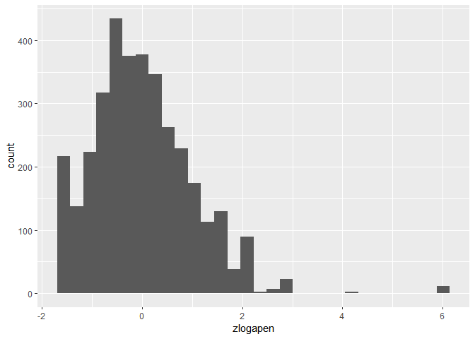
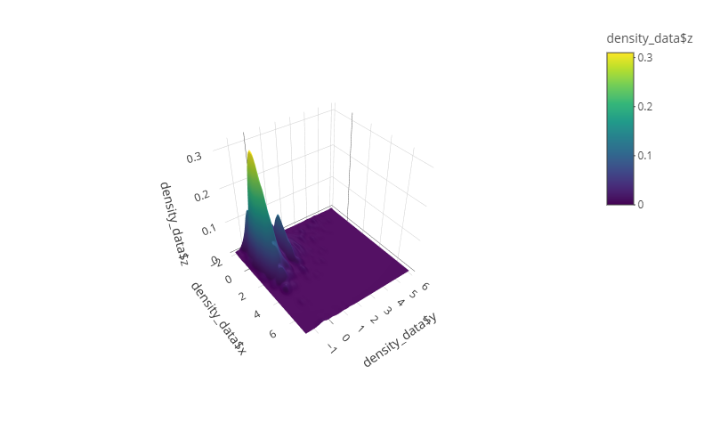
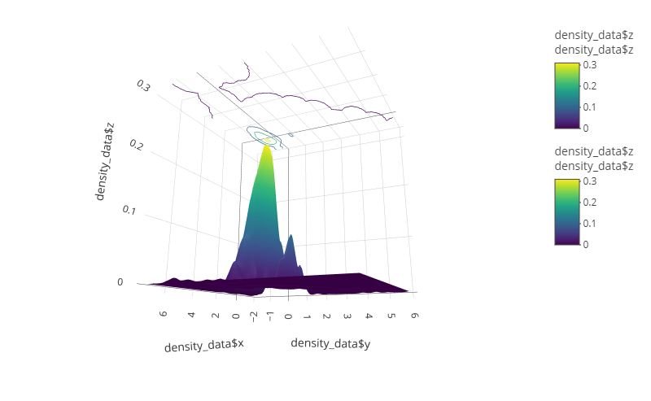

# Multivariate visualization: continuous-continuous variable




In the last two exercises, I will visualize the distribution of data.
More specifically, visualize the distribution of data in relation to
each other, over a joint distribution space, also called multivariate
visualization. In the first (this) exercise, I will visualize two
continuous variables, while in the latter I will visualize the
distribution of data over a categorical variable. To do this, I will use
a dataset related to mind wandering where we have two variables that are
used to predict mind wandering. These two variables related to
behavioural performance during the task and are behavioural variability
(BV), a measure of response variation, and approximate entropy (AE) a
measure of randomness.

I start by loading the libraries, functions and data.

``` r
library(tidyverse)
library(patchwork)
library(ggside)
library(plotly)
library(MASS)
library(Rcpp) 

read_csv("../data/raw_mwtms_data.csv") -> all_mw_data 

sourceCpp("../src/apen.cpp") # load apen conversion
source("../src/transformation.R") # function
```

I then select the relevant data, in this case, I will only use the data
from the “sham” condition. That is the condition in which no
manipulation was done to participants.

``` r
all_mw_data %>% 
  dplyr::select(-region.y) |>
  rename(region = region.x) |>
  filter(stimulation == "sham") -> mw_data

da_pro(mw_data, nback = 25) -> trans_mw
  #' This function has been retrieved from the OSF repository containing the 
  #' data and is slightly modified
```

``` r
trans_mw
```

    # A tibble: 3,509 × 14
       subj  session block proberound probe1 probe2 probe3      apen     bv stim 
       <chr> <chr>   <chr>      <dbl> <ord>  <ord>  <ord>      <dbl>  <dbl> <chr>
     1 AG001 S2      B0             1 4      4      2       0.458    0.0923 sham 
     2 AG001 S2      B0             2 4      4      2       0.444    0.0527 sham 
     3 AG001 S2      B0             3 3      2      3       0.120    0.0574 sham 
     4 AG001 S2      B0             4 3      3      4       0.535    0.0832 sham 
     5 AG001 S2      B0             5 2      4      2       0.151    0.0877 sham 
     6 AG001 S2      B0             6 2      2      4       0.117    0.180  sham 
     7 AG001 S2      B0             7 2      4      4       0.247    0.165  sham 
     8 AG001 S2      B0             8 2      4      2       0.295    0.0488 sham 
     9 AG001 S2      B0             9 2      4      3      -0.000945 0.0439 sham 
    10 AG001 S2      B0            10 3      4      2       0.189    0.178  sham 
    # ℹ 3,499 more rows
    # ℹ 4 more variables: logapen <dbl>, logbv <dbl>, zlogapen <dbl>, zlogbv <dbl>

We can now start plotting the data. There are only a couple of ways one
can visualize the distribution of data over a variable. This could be
with a histogram or a density distribution. A histogram summarizes the
data according to the number of occurrences within a certain span.

``` r
trans_mw |>
  ggplot(aes(x=zlogapen))+
  geom_histogram()
```

    `stat_bin()` using `bins = 30`. Pick better value with `binwidth`.



It is perhaps a better idea to use a histogram over more meaningful
distances of the variable. For instance, an IQ test, where the ranges
are more meaningful. That is, a 5 point increase in IQ is easier to
gauge than a .5 increase in zlogapen. Nevertheless, another way of
plotting the distribution could be to use a frequency polygon.

``` r
trans_mw |>
  ggplot(aes(x=zlogapen)) +
  geom_freqpoly()
```

    `stat_bin()` using `bins = 30`. Pick better value with `binwidth`.


This plot is essentially the same as the histogram, but mimics the
density distributions as shown below. It is, however, important to note
that this is not a density distribution, as the density is calculated
while this plot shows the raw count of each range of value - the same as
the histogram. To visualize the distribution more meaningfully, we could
decrease the “binwidth” or increase the number of bins, such that the
range of collected data decrease.

``` r
trans_mw |>
  ggplot(aes(x=zlogapen)) +
  geom_freqpoly(bins=100)
```


Indeed, in this plot we get a more nuanced view of how the data is
distributed. More specifically, we can see that there are plenty of
values close to -2. This may be because of how AE is calculated where we
can get a ceiling or flooring effect. Even though this specific value
receives a lot of observation, most values are distributed around 0.
Indeed, the range of the normal distribution is greater than the sum of
these extreme score (see below). Moreover, we can see that certain
values receives more counts than others, and this may again stem from a
limit of how AE is calculated.

Indeed, visualizing the raw AE score suggests that we see that most
values centre around 0 (floor) and the ceiling. This is perhaps most
obvious with a density plot (see below).

``` r
trans_mw |> 
  ggplot(aes(apen))+ 
  geom_freqpoly(bins=100)
```


``` r
trans_mw |>
  ggplot(aes(apen))+
  geom_density()
```


To get a better grasp of the distribution over values can be to use a
density visualization. Visualizing using a density function will smooth
the distribution such that it is easier to see the estimated
distribution. (Note: this is visualized with the z scored and log
transformed AE score, which more accurately follow a normal
distribution - compare the above with the below)

``` r
trans_mw |>
  ggplot(aes(x=zlogapen))+
  geom_density()
```


A density plot gives us an estimated probability that a data point will
be found within that value. With this plot, it is more evident that the
data is distributed according to a normal distribution - at least
following the relevant transformations (z-score of the
-log(log(2)-apen)).

By z-scoring AE and BV we can meaningfully plot both distributions in
the same plot.

``` r
trans_mw |>
  pivot_longer(c(zlogapen,zlogbv)) |>
  ggplot(aes(x=value, col=name))+
  geom_density()
```


However, in these cases, the relationship between the variables it may
be ambiguous and underexplored. In particular, we may be interested in
how these two variables relate to each other. This can be achieved by
visualizing the joint distribution with a 2d density plot. This can be
done in multiple ways, for instance, by simply plotting all the data
points.

``` r
trans_mw |> 
  ggplot(aes(x=zlogbv, y=zlogapen))+ 
  geom_point()
```


An obvious problem arise as the data points overlap and hide each other.
One solution is to add transparency so we can see all (or mostly all)
data points - and also how they overlap.

``` r
trans_mw |> 
  ggplot(aes(x=zlogbv, y=zlogapen))+ 
  geom_point(alpha=.1)
```


Nevertheless, it is not easy to gauge the number of observations within
each value. However, the plot nevertheless reveal some interesting
findings. For instance, we can see that for the BV variable, how data
points cluster around 0 but also, around 1.5 standard deviations above
0.

Alternatively, and similarly to histograms, we can count the number of
observations within a span. This can be done by using hexagons:

``` r
trans_mw |> 
  ggplot(aes(x=zlogbv, y=zlogapen))+ 
  geom_hex() -> mw_hex
mw_hex
```


In this plot, we can see how BV and AE relate to each other. This is
informative because the assumption with these two variables are that
when participants are focused on the task, they should generate high AE
score and have consistent BV. If this is the case, then we would expect
that BV remains around zero, and that AE is high when participants are
focused on the task. On the other hand, when participants are not
focused on the task, they should show more BV and lower AE. This can be
gauged to some degree on the previous plot. To indicate what I mean, I
have highlighted the areas corresponding to each state of mind wandering
below.

``` r
mw_hex +
  annotate("rect", xmin=1.5, xmax=6.5, ymin=-1.75,ymax=1.75, alpha=.0, col="red")+
  annotate("text", label="Mind wandering", x=5.5,y=1.3, alpha=1, col="red")+
  annotate("rect", xmin=-1.5, xmax=1.5, ymin=1.75,ymax=6.2, alpha=.0, col="red")+
  annotate("text", label="Task focused", x=0,y=5, alpha=1, col="red")
```


However, we do not exactly find this distribution. Although, it is
important to point out that these marked areas are quite extreme (but
made for illustrative purposes). Since the data is z-scored, most data
will gather within the value of -2 and +2, and only a few cases to the
extreme. If anything, the annotations I have made should be closer to
the centre . Regardless, it is difficult to gauge the distribution over
various cognitive states from this plot. In the fourth exercise I will
investigate the distribution over different cognitive states (mind
wandering/mind blanking). There the distribution should be different
(i.e., the mean is different), but still follow a normal distribution.
For this exercise, however, I will visualize the joint distribution of
AE and BV. This can, nevertheless, reveal some intriguing things, as we
can see from the plot above.

We can see that BV has more extreme observations than AE, for instance.
Moreover, AE seems to take great leaps for the more extreme values.
Nevertheless, most of the data seems to be relatively normally
distributed. As noted above, we can see that for BV, data seems to
gather around 0 but also around 1.5 standard deviations above 0. In
addition to that, we can see that AE does not really change for these
values - it seems to be relatively similarly distributed at both 0 and
1.5 standard deviations of BV. In a similar vein, AE has most values
clustered around 0 (because of z-scoring), but we can also see that AE
has a good number of observations at the very bottom (close to -2).
Furthermore, these data points are mostly clustered around a BV of 0,
but seems to follow some normal distribution around a low AE.

``` r
mw_hex +
  annotate("rect", xmin=.75, xmax=2, ymin=-1.75,ymax=1.75, alpha=.0, col="red")+
  annotate("rect", xmin=-1.5, xmax=1, ymin=-1.8,ymax=-1.2, alpha=.0, col="red")
```


At any rate, although the hexagons indicate the number of observation
within a certain value span. It may be more beneficial to use a density
function, which smooths and summarize the distribution in bands of
probability.

``` r
trans_mw |> 
  ggplot(aes(x=zlogbv, y=zlogapen)) -> joint_ae.bv
  
joint_ae.bv +
  geom_density2d()
```


With this plot, we can see the probability that a data point falls
within a specific value. More specifically, how the joint parameter
space is distributed. In line with what I wrote above, we see a slight
tendency towards the distribution I outlined above.

We can use different density functions, different binwidths or different
number of bins to improve visualization.

``` r
joint_ae.bv + 
  geom_density2d(contour_var = "count")
```


In this plot, the density function is visualized as a multiplication by
the number of observations. Alternatively, we could visualize with the
“ndensity” which is scaled to a maximum of 1:

``` r
joint_ae.bv + 
  geom_density2d(contour_var = "ndensity")
```


The latter two are visualized according to changes to the density
function, which may have led to some changes in number of bins.

If we follow the basic density function, we see that most values fall
within the bands of the density function.

``` r
joint_ae.bv + 
  geom_point(alpha=.1)+
  geom_density2d(col="red", linewidth=1)
```


A different way of visualizing, is to use colours indicating higher
probability.

``` r
joint_ae.bv + 
  geom_density2d_filled()
```


With this plot, we can more easily see the higher probability areas over
the joint parameter space. To make it clear that we are looking at the
join distribution of AE and BV, we can add the individual distributions
to the plot by using patchworks.

``` r
# Here, I use the patchwork library

# Joint distribution
joint_ae.bv+
  geom_density2d_filled() -> p_joint 

# BV distribution
trans_mw |> 
  ggplot(aes(zlogbv))+ 
  geom_density()+
  theme_void() -> p_bv

# AE distribution
trans_mw |> 
  ggplot(aes(zlogapen))+
  geom_density()+
  theme_void()+
  coord_flip() -> p_ae

# Combining using patchwork
p_bv + 
  ggplot()+ theme_void() + # Empty element 
  p_joint + 
  p_ae
```


Although we can see the individual distributions and the joint
distribution, it is not perfect due to the way patchworks glues plots
together. Another solution is to use the package “ggsides”, in this
library we can add a side density to the main plot with one line of
code:

``` r
# library(ggside)
joint_ae.bv + 
  geom_density_2d_filled()+ 
  geom_xsidedensity()+
  geom_ysidedensity()
```


With this library, we get a more neat visualization of both the
individual and joint distribution. Moreover, using a coloured 2D density
distribution we can more easily see how the data is distributed. Indeed,
we can see that BV seems to have two areas of observations as noted
above. Moreover, it seems like AE has a wider distribution, which might
be beneficial if we want to observe a difference between cognitive
states.

With this, I will try and make the plot more neat with aesthetic
changes.

``` r
min(trans_mw$zlogapen) -> AE_min
min(trans_mw$zlogbv) -> BV_min

joint_ae.bv +
  geom_density_2d_filled()+
  theme_minimal()+
  labs(x= "Z-scored BV", y="Z-scored AE", fill="Density") -> neat_ae.bv

neat_ae.bv +  
  coord_cartesian(expand = F, xlim=c(AE_min,2), ylim=c(BV_min,2.5))+
  geom_xsidedensity()+ 
  geom_ysidedensity()+
  scale_xsidey_continuous(expand=F, limits = c(0,1), breaks = seq(0,1,1))+
  scale_ysidex_continuous(expand=F, limits = c(0,1), breaks = seq(0,1,1))+
  theme(ggside.panel.scale=.4) -> p_ggside
p_ggside  
```


One aesthetic change is to zoom into the main density area of the plot,
which is mainly in the bottom-left corner. However, doing this, has led
to some cases related to the side densities. The side densities inherit
the *coord_cartersian* feature from the ggplot object, making it wider,
and thus harder to see the density that is locked between 0 and 1. I
have not been able to find a solution to limit only the main plot, and
not the side plots. An alternative is to use scale_x/y with the “limits”
parameter. However, this will also remove data points from outside the
graph. Leading to other problems…

``` r
neat_ae.bv + 
  coord_cartesian(expand=F)+
  scale_x_continuous(limits=c(-2,2))+ 
  scale_y_continuous(limits=c(-2,3))+
  geom_xsidedensity()+
  geom_ysidedensity()+
  scale_xsidey_continuous(limit=c(0,1), breaks = 1)+
  scale_ysidex_continuous(limit=c(0,.5), breaks = .5)+
  theme_ggside_minimal()+
  theme(ggside.panel.scale=.35,
        ggside.panel.grid.minor=element_blank(),
        ggside.panel.grid.major=element_blank(),
        )
```

    Warning: Removed 153 rows containing non-finite values
    (`stat_density2d_filled()`).

    Warning: Removed 139 rows containing non-finite values (`stat_density()`).

    Warning: Removed 14 rows containing non-finite values (`stat_density()`).


Even thought it might not be obvious from the plot above, data points
outside the range that is displayed are removed. However, the
distribution of the remaining data points are valid, but does not
capture all the data points any more (compare to the above or below).

Thus, if we wish to visualize the distribution of the data, we should
include all the data points we can. For this purpose, I will stick with
the *coord_cartesian* scale, and increase the size of the side plots to
improve its visibility.

``` r
neat_ae.bv +  
  coord_cartesian(expand = F, xlim=c(AE_min,2), ylim=c(BV_min,2.5))+
  geom_xsidedensity()+ 
  geom_ysidedensity()+
  scale_xsidey_continuous(breaks = c(0, 1))+
  scale_ysidex_continuous(breaks = c(0,.5))+
  geom_xsideline(aes(y=0), linetype = 2, alpha =.5)+ 
  geom_xsideline(aes(y=1), linetype = 2, alpha =.5)+ 
  geom_ysideline(aes(x=0), linetype = 2, alpha = .5)+ 
  geom_ysideline(aes(x=1), linetype = 2, alpha = .5)+ 
    # No idea why these latter two do not draw a dashed line...
  theme(ggside.panel.scale = .8,
        ggside.panel.background = element_blank(), 
        ggside.panel.grid.minor = element_blank(), 
        ggside.panel.grid.major = element_blank(), 
        ggside.panel.border = element_blank(),
        panel.grid.major = element_blank(),
        panel.grid.minor = element_blank(),
        )
```


However, the problem remains. It is still hard to see the exact
distributions of the densities on the side. This could plausibly be
fixed by re-scaling the side plots. However, I have not been able how to
do this, even though plausible functions should be able to do it (e.g.,
scale_xsidey_continous, e.g.,
https://rdrr.io/cran/ggside/man/ggside-scales-continuous.html). I assume
that *coords_cartesian* supersede (local) scale changes, and thus I are
unable to change the scale of the side distributions - see below for an
attempt.

``` r
neat_ae.bv +  
  coord_cartesian(expand = F, xlim=c(AE_min,2), ylim=c(BV_min,2.5))+
  geom_xsidedensity()+ 
  geom_ysidedensity()+
  scale_xsidey_continuous(breaks = c(0, 1), expand = F, limits = c(0,1))+
  scale_ysidex_continuous(breaks = c(0,.5), expand = F, limits = c(0,1))+
    # limits and expand does not alter the plot!
  theme(ggside.panel.scale = .5)
```


Another way of visualizing the data distribution is to use 3 dimensional
(3D) plots.

``` r
# https://plotly.com/r/3d-surface-plots/
kde2d(trans_mw$zlogbv, 
      trans_mw$zlogapen, 
      n = 100
      ) -> density_data
  # Using a MASS extension to create the Z variable

plot_ly(x=~density_data$x, y=~density_data$y, z=~density_data$z, 
        type="surface") |>
  layout(
    scene = list( 
      camera = list(
        eye = list(x=2,y=-1.5,z=2)))) -> plotly_plot
  #' plotly creates a html element that cannot be converted by quarto. Therefore, 
  #' I saved the picture and link it in the below (as ) 
```



Moreover, we can add a contour to the top of the plotly to both see a 2D
and 3D representation.

``` r
plot_ly(x=~density_data$x, y=~density_data$y, z=~density_data$z,
        type="surface") |>
  add_surface(
    contours = list(
    z = list(
      show = T,
      usecolormap = T,
      highlightcolor = "#ff0000",
      project = list(z = T)
      )
    )
  ) |>
   layout(
    scene = list(
      camera = list(
        eye = list(x=1.87, y=0.88, z=-0.64)
        )
      )
    ) -> plotly_plot2
```



There can arise various problems when visualizing things in 3D. However,
it can also be uniquely informative - especially since these plots are
interactive. That’s, the plot can be rotated and zoomed within R (it is
a HTML element). However, if the reader is reading through a text format
(e.g., PDF) file (or otherwise), such an interactive exploration of the
data distribution is not possible. Nevertheless, this plot does not use
*ggplot*, since ggplots do not have a way to visualize things in 3D. For
this plot, I have used *plotly*, which is a library that can visualize
data in 3D. However, I will not explore plotly in depth as it is beyond
the scope of ggplot, but is nevertheless interesting to point out.

Thus, in summary, visualizing the joint distribution of two variables
can be informative in relation to how these variables interact. It can
become evident whether the distribution changes depending on some
variable. In this case, we would expect that higher values of AE would
be associated with more consistent BV. Although, it is not entirely
clear whether this is the case, as there is much variation in the
distributions. In the next exercise, I turn to visualizing distribution
over a categorical variable.
