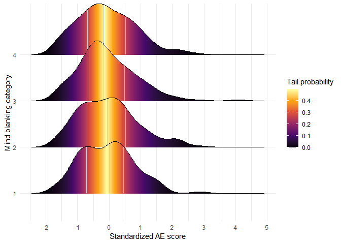

# Multivariate visualization: categorical-continuous variable




For this exercise, I will visualize distributions over a categorical
variable. More specifically, I would like to visualize the distribution
of AE over different cognitive states (such as mind wandering and mind
blanking). As noted in the previous report, visualizing over categories
can be more informative if we expect that one state should result in a
different outcome. In our case, we might expect that when people report
being focused on the task that their randomness generation is improved,
as compared to the other cognitive states.

Firstly, I load the libraries and transform the data.

``` r
library(tidyverse)
library(ggridges)
read_csv("../../ex3/data/raw_mwtms_data.csv") -> all_mw_data 
source("../../ex3/src/transformation.R") # AE calculation
```

``` r
all_mw_data |> 
  dplyr::select(-region.y) |>
  filter(stimulation == "sham") -> mw_data
da_pro(mw_data, nback = 25) -> trans_mw
```

    # A tibble: 3,509 × 14
       subj  session block proberound probe1 probe2 probe3      apen     bv stim 
       <chr> <chr>   <chr>      <dbl> <ord>  <ord>  <ord>      <dbl>  <dbl> <chr>
     1 AG001 S2      B0             1 4      4      2       0.458    0.0923 sham 
     2 AG001 S2      B0             2 4      4      2       0.444    0.0527 sham 
     3 AG001 S2      B0             3 3      2      3       0.120    0.0574 sham 
     4 AG001 S2      B0             4 3      3      4       0.535    0.0832 sham 
     5 AG001 S2      B0             5 2      4      2       0.151    0.0877 sham 
     6 AG001 S2      B0             6 2      2      4       0.117    0.180  sham 
     7 AG001 S2      B0             7 2      4      4       0.247    0.165  sham 
     8 AG001 S2      B0             8 2      4      2       0.295    0.0488 sham 
     9 AG001 S2      B0             9 2      4      3      -0.000945 0.0439 sham 
    10 AG001 S2      B0            10 3      4      2       0.189    0.178  sham 
    # ℹ 3,499 more rows
    # ℹ 4 more variables: logapen <dbl>, logbv <dbl>, zlogapen <dbl>, zlogbv <dbl>

Then we can start by visualizing the distribution of the different
cognitive states. I will start with a simple point plot

``` r
trans_mw |>
  ggplot(aes(x=probe1, y=zlogapen))+
  geom_point(alpha = .2, position = position_jitter(.2))
```


(Lower values indicate more mind wandering.)

Visualizing data in this way makes it hard to understand the
distribution within each category. Although we can clearly see that 3
and 4 have more responses than 1 and 2. That is, the difference between
the conditions categories are evident, even though it is not entirely
clear whether it is normally distributed.

To investigate this, we can use a histogram and colour them according to
the categorical response.

``` r
trans_mw |> 
  ggplot(aes(x=zlogapen, group=probe1, col=probe1,fill=probe1))+
  geom_histogram(alpha=.3)
```

    `stat_bin()` using `bins = 30`. Pick better value with `binwidth`.


In this plot, the bars are stacked on top of each other, which can make
it problematic to see whether the data is distributed normally,
especially for the lower probe responses (higher stacked bars). To fix
this, we can position the bars beside each other.

``` r
trans_mw |> 
  ggplot(aes(x=zlogapen, group=probe1, fill=probe1))+
  geom_histogram(alpha=.3, position = position_dodge(), col="black", size=.15
                 ) -> p_hist 
```

    Warning: Using `size` aesthetic for lines was deprecated in ggplot2 3.4.0.
    ℹ Please use `linewidth` instead.

``` r
p_hist
```

    `stat_bin()` using `bins = 30`. Pick better value with `binwidth`.


With this plot, the distribution within each categorical response is
more evident, but regardless, still difficult to read. This can be fixed
by splitting the distribution, which can be done by using facets.

``` r
p_hist +
  facet_wrap(~probe1)
```

    `stat_bin()` using `bins = 30`. Pick better value with `binwidth`.


In this graph, the distribution within each response is clearly evident
and easy to read. Moreover, it appears as though the distribution within
the first categorical response is flat, at least compared to the other
distributions. To further investigate this, we can easily change the
distribution to a density distribution. A kernel density estimation
creates a smooth and continuous representation of the distribution.

``` r
trans_mw |> 
  ggplot(aes(x=zlogapen, group=probe1, fill=probe1, col=probe1))+
  geom_density(alpha=.2)
```


As we can see from the plot, all the distributions over each category
are surprisingly similar, at least compared to the histogram
representation. We can further split the difference between the
distributions by using *facets*.

``` r
trans_mw |> 
  ggplot(aes(x=zlogapen, group=probe1, fill=probe1))+
  geom_density(alpha=.3)+
  facet_wrap(~probe1)
```


With this plot, we can see more nuances in each distribution. However,
they appear to be more similar than dissimilar.

Similarly to exercise 3, we can also visualize the distribution using a
2d density visualization.

``` r
trans_mw |> 
  mutate(probe1=as.numeric(probe1)) |>
  ggplot(aes(x=probe1, y=zlogapen))+
  geom_density2d_filled()
```


We can clearly see that the fourth response received more responses than
the first. However, since the density is spread over plus and minus
values, it appears as though responses are spread around the categorical
response. It is important to point out that it remains a bit ambiguous
how to interpret the distribution. Readers are aided to think of the
distribution as happening in two dimensions when it only happens in one
dimension. That is to say, the data distribution within one categorical
response only happens according to the cluster of data points of AE
values - not at the same time a distribution around the probe response.
It is suggested that the data distributes around each response (e.g.,
2.9 to 3.1), even though they are perfectly symmetrical and one side
could safely be removed. With such a choice, it would be more evident
that we are talking about only a one dimensional distribution over
different categories.

One way to improve on this is to visualize using violin plots:

``` r
trans_mw |> 
  ggplot(aes(y = zlogapen, x=probe1, fill=probe1))+
  geom_violin(alpha=.2, bw = "SJ")
```


With the violin plot, we are better able to see the distribution,
although we might benefit by flipping it:

``` r
trans_mw |> 
  ggplot(aes(x = zlogapen, y = probe1, fill=probe1))+
  geom_violin(alpha = .2, bw = "SJ")
```


Even with this, it is not entirely clear how it is distributed (compared
to the below). Indeed, it might be confusing that the graph, in a
similar way to the 2D density distribution (two above), still indicate
the distribution over two axis (above/below the category).

One way of changing this is to use the *ggridges* library, which makes
it easy to visualize data distributions over categories.

``` r
trans_mw |> 
  ggplot(aes(x=zlogapen, y=probe1, fill=probe1))+
  geom_density_ridges(scale = 1.3, alpha=.3)+
  coord_flip()
```

    Picking joint bandwidth of 0.221


With this plot, we can more easily understand that we are talking about
a distribution over a categorical variable. Moreover, it is easier to
comprehend the distribution over each categorical response than the
(above) 2D distribution. The *ggridges* library is clearly superior in
many regards, as it overlays the distributions without disrupting the
distribution behind it, but still making comparisons easily. For
instance, the first cases used histograms, which makes it hard to
compare the distribution because it uses count summary. While using
density made comparison of the distribution easier, it was hard to see
the individual distributions when they were overlapped, but difficult to
compare when they were split by facets. Thus, *ggridges* makes it a
better compromise between these two options, making it easier to both
see the individual distribution, but also compare the distribution over
each response.

``` r
trans_mw |> 
  ggplot(aes(x = zlogapen, y = probe1))+
  geom_density_ridges()
```

    Picking joint bandwidth of 0.221


This leads to a more neat presentation of the distribution over each of
the categorical responses. Moreover, it is now a bit easier to read the
distributions. It seems like the 3 and 4 response have slightly longer
distributions, suggesting that higher AE might be associated with more
on task reporting. Although, this is by no means obvious, but a mere
suggestion based on the distributions.

With this, there are a couple of aesthetic changes we can do. For
instance, we could draw all individual points:

``` r
trans_mw |> 
  ggplot(aes(x = zlogapen, y = probe1))+
  geom_density_ridges(jittered_points = T, # Add jittering points
                      point_alpha = .2,
                      scale = 1.05)+
  scale_x_continuous(breaks = seq(-8,8,1))
```

    Picking joint bandwidth of 0.221


However, the resulting plot can be more difficult to interpret, granted
a large data set. Indeed, for massive data sets, it is possible that
there will be nothing other than a black graph - of points.

``` r
trans_mw |> 
  ggplot(aes(x = zlogapen, y = probe1))+
   geom_density_ridges(
    jittered_points = T, scale = .95,
    position = position_points_jitter(width = 0.05, height = 0),
      # Creates a rug position of the "points"
    alpha = .2, 
      # This sets the transparency of the Density distribution (the points 
      # ("|") are drawn behind the distribution).
    # Point changes: 
    point_shape = '|',  # Shape of the point
    point_size = 2.5,
    point_alpha = .2 )+
  scale_x_continuous(breaks=seq(-8,8,1))+
  theme_minimal()
```

    Picking joint bandwidth of 0.221


This plot is more intelligible than the former point plot. Here, we can
see how certain areas contain more data points. More specifically, how
points gather around -1.75 for the 3 and 4 response categories, as well
as a tendency for the other categories. As noted earlier, it is also
suggested that there are, in fact, slightly more points for higher AE
for the 3 and 4 category. Although, this might merely be because these
categories have more overall responses, as the same pattern can be found
for the first and second category.

Another way of plotting is using a “raincloud”:

``` r
trans_mw |> 
  ggplot(aes(x = zlogapen, y = probe1))+
   geom_density_ridges(
     jittered_points = T, scale = 0.6, alpha = 0.7,
     position = position_raincloud(),
     point_size = 0.4, point_alpha = .2)+
  scale_x_continuous(breaks=seq(-8,8,1))+
  theme_minimal()
```

    Picking joint bandwidth of 0.221


In this plot, each of the individual data points “rain down” from the
distribution. With this plot, it is easier to see which distribution
contains the most observations (4), and the least (1). Moreover, we can
see how many observations cluster around certain values (e.g., -1.6 and
2.2).

With this package, it is also possible to easily add quantile lines:

``` r
trans_mw |> 
  ggplot(aes(x = zlogapen, y = probe1))+
   geom_density_ridges(
     jittered_points = T, scale = 0.6, alpha = 0.7,
     position = position_raincloud(adjust_vlines = T),
     point_size = 0.4, point_alpha = .2,
     quantile_lines = T, 
     vline_size = 1.2, vline_color = "red")+
  scale_x_continuous(breaks=seq(-8,8,1))+
  theme_minimal()
```

    Picking joint bandwidth of 0.221


In this plot, the red lines indicate the quantiles, in which an equal
number of data observations are found. With the above plot, the
quantiles are displayed over the “raincloud” of data points. If we
remove the “jittered_points” (FALSE) then we get the quantiles over the
distribution itself:

``` r
trans_mw |> 
  ggplot(aes(x = zlogapen, y = probe1))+
   geom_density_ridges(
     quantile_lines = T,
     vline_size = .8, vline_color = "red")+
  scale_x_continuous(breaks=seq(-8,8,1))+
  theme_minimal()
```

    Picking joint bandwidth of 0.221


In the plot above, it is a bit easier to grasp the width of the
quantiles, and the height of the density function. For this reason, this
plot may be preferred over the raincloud - at least when it comes to
quantile visualization.

Moreover, it is also possible to colour the ridges according to the
probability of obserivng a data point in a certain band range:

``` r
trans_mw |> 
  ggplot(aes(x=zlogapen, y=probe1, fill = 0.5 - abs(0.5 - after_stat(ecdf))))+
  geom_density_ridges_gradient(scale = 1.3, calc_ecdf = T)+ 
    # https://wilkelab.org/ggridges/articles/introduction.html
  scale_fill_viridis_c(name = "Tail probability", option = "inferno")+
  theme_minimal()+
  scale_x_continuous(breaks = seq(-8,8,1))+
  labs(y = "Mind wandering category", x = "Standardized AE score")
```

    Picking joint bandwidth of 0.221


In the above plot, I visualize the density distribution over each
categorical response of mind wandering and colouring the plot according
to the probability of observing an observation within a band. We can
easily add quantiles lines to also indicate where most of the data is
found - although, this might be obvious from the plot in itself.

``` r
trans_mw |> 
  ggplot(aes(x=zlogapen, y=probe1, fill = 0.5 - abs(0.5 - after_stat(ecdf))))+
  geom_density_ridges_gradient(scale = 1.3, calc_ecdf = T, 
                               quantile_lines = T,
                               vline_color="lightblue")+ 
  scale_fill_viridis_c(name = "Tail probability", option = "inferno")+
  theme_minimal()+
  scale_x_continuous(breaks=seq(-8,8,1))+
  labs(y="Mind wandering category", x="Standardized AE score")
```

    Picking joint bandwidth of 0.221


In the above plot, there are both quantile lines and coloured
probability of observing a value within a range. Due to the colouring,
it might not be necessary with the quantile lines. Although, I would say
that the colour adds an element that is missing in the prior plots. At
any rate, there is not much to suggest that there is any difference
between the categorical response and the distribution of AE. To check
whether the plot works, I will quickly turn to BV.

``` r
trans_mw |> 
  ggplot(aes(x=zlogbv, y=probe1, fill = 0.5 - abs(0.5 - after_stat(ecdf))))+
  geom_density_ridges_gradient(scale = 1.3, calc_ecdf = T, 
                               quantile_lines = T,
                               vline_color = "lightblue")+ 
  scale_fill_viridis_c(name = "Tail probability", option = "inferno")+
  theme_minimal()+
  scale_x_continuous(breaks=seq(-8,8,1))+
  labs(y = "Mind wandering category", x = "Standardized BV score")
```

    Picking joint bandwidth of 0.175


In the above plot, it is a bit more evident that there is a difference
between the categorical responses. The lowest categories (1 and 2) seem
to have a bit wider bands and distributions than the higher categories
(3 and 4). We can, for instance, see that the quantiles for the fourth
category are more normally distributed than the first. Thus, more data
is observed closer to 0, which indicates better task performance.
Similarly, the distribution seems to be wider for the first category
than the fourth, suggesting that there might be some differences (albeit
not that big, perhaps).

The former plots have not been apparent regarding whether there is any
difference between the categorical response, and the behavioural
performance measures. To illustrate, I will use an entirely different
data set called “iris”, which is found in base R. The data set includes
measures of flowers of the petal length and width, sepal width and
length, and species of the flower. Making it possible to visualize a
categorical (species) variable over various continuous variables
(width/length).

``` r
iris |>
  ggplot(aes(x = Sepal.Length, y = Species))+
  geom_density_ridges()
```

    Picking joint bandwidth of 0.181


With this data set, we can clearly see that these species have different
sepal length. Although, the length is not standardized, but to do so, we
can use the *scale* function.

``` r
iris |>
  mutate(scaled_length = scale(Sepal.Length)) |>
  ggplot(aes(x = scaled_length, y = Species))+
  geom_density_ridges()
```

    Picking joint bandwidth of 0.218


In the above plot, we can see that a setosa’s length is about one
standard deviation below vericolor, and 1.7 (or so) below the virginica
flower. These datasets can make differences more obvious by visualizing
a distribution over a categorical response. In the case of the
randomness (AE) score, it is not as clear whether there is a difference
between the categorical responses. This might be expected by the fact
that the categorical responses are related to a more continuous scale
(focused or not), wherein there can be a wide range of different states.
Indeed, we could try to visualize AE/BV score over mind blanking, which
is a different variable.

``` r
trans_mw |> 
  filter(probe1<3) |>
  ggplot(aes(x = zlogapen, y = probe2, fill = 0.5 - abs(0.5 - after_stat(ecdf))))+
  geom_density_ridges_gradient(scale = 1.3, calc_ecdf = T, 
                               quantile_lines = T,
                               vline_color = "lightblue")+ 
  scale_fill_viridis_c(name = "Tail probability", option = "inferno")+
  theme_minimal()+
  scale_x_continuous(breaks = seq(-8,8,1))+
  labs(y = "Mind blanking category", x = "Standardized AE score")
```

    Picking joint bandwidth of 0.274



(Lower category indicate more blanking.) In the above plot, I have
plotted the mind blanking response only for those who reported to mind
wandering (1 and 2). We might expect those who mind blanked (1 and 2) to
produce worse AE than those who did not report to mind blank (3 and 4).
Such a trend is not obvious from the distribution. In fact, it might
seem that mind wandering (4) seems to have a second peak at a reduced AE
score. Although this might be the case because it has more cases
(however, this is not entirely clear, see below).

At any rate, it paints a rather similar pattern to the previous plots.
It is not entirely clear whether there is any difference between the
categorical responses (there is a lot of overlap). Nevertheless, we can
see that the categorical response 3 and 4 have a second peak at around
-1.7 (or so).

``` r
trans_mw |> 
  filter(probe1<3) |>
  ggplot(aes(x = zlogapen, y = probe2))+
  geom_density_ridges(
    jittered_points = T, scale = .95,
    position = position_points_jitter(width = 0.05, height = 0),
      # Creates a rug position of the "points"
    alpha = .2, 
      # This sets the transparency of the Density distribution (the points 
      # ("|") are drawn behind the distribution).
    # Point changes: 
    point_shape = '|',  # Shape of the point
    point_size = 2.5,
    point_alpha = .2 )
```

    Picking joint bandwidth of 0.274


Even though AE (randomness) score did not have any clear differences,
maybe BV has any clearer differences:

``` r
trans_mw |> 
  filter(probe1 < 3) |>
  ggplot(aes(x = zlogbv, y = probe2, fill = 0.5 - abs(0.5 - after_stat(ecdf))))+
  geom_density_ridges_gradient(scale = 1.3, calc_ecdf = T, 
                               quantile_lines = T,
                               vline_color = "lightblue")+ 
  scale_fill_viridis_c(name = "Tail probability", option = "inferno")+
  theme_minimal()+
  scale_x_continuous(breaks = seq(-8,8,1))+
  labs(y = "Mind blanking category", x = "Standardized BV score")
```

    Picking joint bandwidth of 0.269


It might seem as though categorical response 3 and 4 (indicating mind
wandering or content) have a more normal distribution. Moreover, they
seem to have a slightly reduced second peak (at around 1.35). While the
lower category (1 and 2) seem to have a bit wider distribution and a
higher second peak. It should be noted that only the higher categories
(3, 4) seem to sometimes become more task disengaged by some higher
scores. In this way, it can appear as though most people are more
consistent when reporting to have content (mind blanking - 3/4), but
might (sometimes) be more disconnected. While, mind blanking (1, 2)
might have a wider distribution, they do not seem to have very high
(albeit some observation) scores. Thus, it might be said that when
people think about nothing in particular, they are generally less task
focused, but might not entertain these ideas as much - hence not
observing fewer high-value cases.
